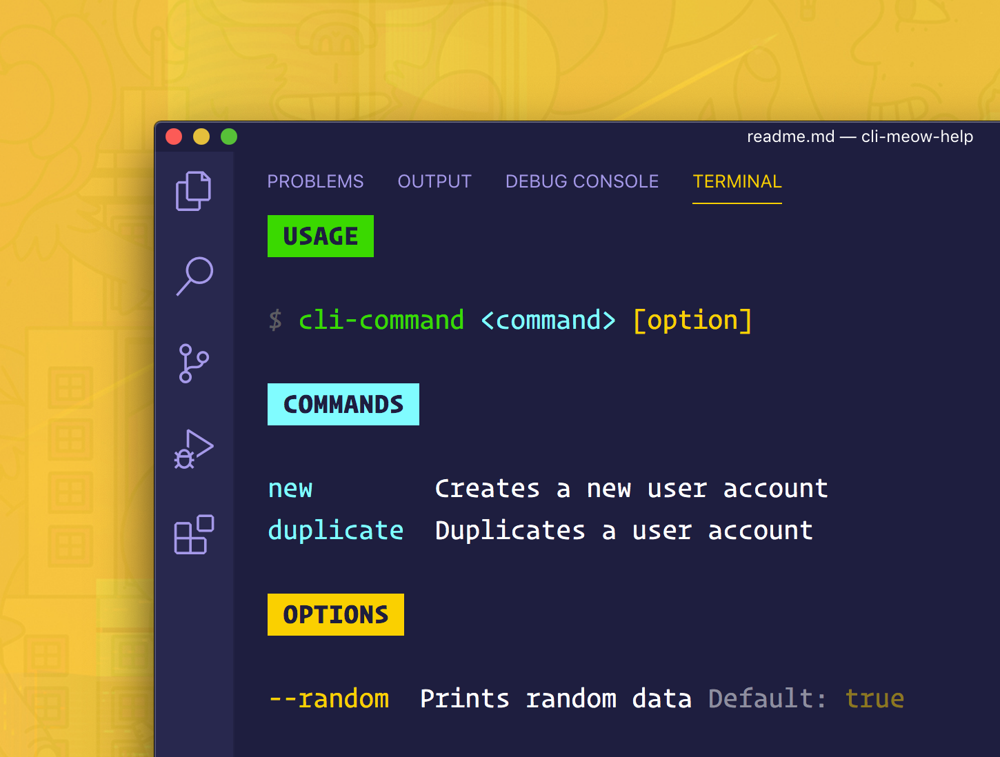

[](./../../)

# cli-meow-help

[](https://www.npmjs.com/package/cli-meow-help) [](https://NodeCLI.com/?utm_source=FOSS) [](https://VSCode.pro/?utm_source=FOSS) [](https://github.com/ahmadawais/sponsor?utm_source=FOSS)
[](https://twitter.com/mrahmadawais/)

> Generate automatically formatted help text for [`meow`](https://github.com/sindresorhus/meow) CLI helper

<br>

[](./../../)

## Install

```sh
npm install meow cli-meow-help
```

<br>

[](./../../)

## Usage

```js
const meow = require('meow');
const meowHelp = require('cli-meow-help');

const commands = {
	new: {desc: `Creates a new user account`},
	duplicate: {desc: `Duplicates a user account`}
};

const flags = {
	random: {
		desc: `Prints random data`,
		type: 'boolean',
		default: true
	}
};

const helpText = meowHelp({
	name: `cli-command`,
	flags,
	commands
});

meow(helpText, {flags});

// Now run `cli-command --help` to view the
// following auto formatted & generated help info.
```

[](./../../)

<br />

[](./../../)

## API

### meowHelp(options)

#### ❯ options

Type: `object`

Default: ↓

```js
{
	name = `(CLI name undefined)`,
	desc,
	commands = {},
	flags = {},
	examples = [],
	defaults = true,
	header,
	footer
}
```

You can specify the options below.

#### ❯ name

Type: `string`<br>
Default: `(CLI name undefined)`

The `bin` command name of the cli that's used to run the CLI. Examples: `corona` for the [corona-cli](https://github.com/AhmadAwais/corona-cli) that's installed globally or `npx corona-cli` for if `npx` is the recommended usage.

#### ❯ desc

Type: `string`<br>
Default: `undefined` (optional)

Optionally define a description text for the help message.

#### ❯ commands

Type: `string`<br>
Default: `{}` (optional)

Optionally, define a JavaScript object containing info on the CLI commands (i.e. `meow` inputs). Each command has a `desc` property to define the help text.

#### ❯ flags

Type: `string`<br>
Default: `{}`

Define CLI options (i.e. `meow` flags) just like you do with `meow` which is the `flags` JavaScript object containing each flag with an extra `desc` property to define the help text.

##### > examples

Type: `Array`<br>
Default: `[]`

List optional examples of how to use the CLI.

> Check the [test](./test.js) file for more context. Format example:

```js
const examples = [

	{
		command: `new`,
		flags: [`random`]
	}
];
```


#### ❯ defaults

Type: `string`<br>
Default: `true` (optional)

Prints out the default values of flags. Set to `false` to disable.

#### ❯ header

Type: `string`<br>
Default: `undefined` (optional)

Optionally, add additional header information.

#### ❯ footer

Type: `string`<br>
Default: `undefined` (optional)

Optionally, add additional footer information.

<br>

[](changelog.md)

## Changelog

[❯ Read the changelog here →](changelog.md)

<br>

<small>**KEY**: `📦 NEW`, `👌 IMPROVE`, `🐛 FIX`, `📖 DOC`, `🚀 RELEASE`, and `🤖 TEST`

> _I use [Emoji-log](https://github.com/ahmadawais/Emoji-Log), you should try it and simplify your git commits._

</small>

<br>

[](./../../)

## License & Conduct

- MIT © [Ahmad Awais](https://twitter.com/MrAhmadAwais/)
- Thanks to Maarten Brakkee for initial implementation
- [Code of Conduct](code-of-conduct.md)

<br>

[](./../../)

## Connect

<div align="left">
    <p><a href="https://github.com/ahmadawais"></a>&nbsp;<small><strong>(follow)</strong> To stay up to date on free & open-source software</small></p>
    <p><a href="https://twitter.com/MrAhmadAwais/"></a>&nbsp;<small><strong>(follow)</strong> To get #OneDevMinute daily hot tips & trolls</small></p>
    <p><a href="https://www.youtube.com/AhmadAwais"></a>&nbsp;<small><strong>(subscribe)</strong> To tech talks & #OneDevMinute videos</small></p>
    <p><a href="https://AhmadAwais.com/"></a>&nbsp;<small><strong>(read)</strong> In-depth & long form technical articles</small></p>
    <p><a href="https://www.linkedin.com/in/MrAhmadAwais/"></a>&nbsp;<small><strong>(connect)</strong> On the LinkedIn profile y'all</small></p>
</div>

<br>

[](https://github.com/AhmadAwais/sponsor)

## Sponsor

Me ([Ahmad Awais](https://twitter.com/mrahmadawais/)) and my incredible wife ([Maedah Batool](https://twitter.com/MaedahBatool/)) are two engineers who fell in love with open source and then with each other. You can read more [about me here](https://ahmadawais.com/about). If you or your company use any of my projects or like what I’m doing then consider backing me. I'm in this for the long run. An open-source developer advocate.

[](https://twitter.com/mrahmadawais/)

### [NodeCLI.com][n] — Learn to build Node.js CLI Automation

> This repository is part of the [NodeCLI.com][n] course.

After building hundreds of developer automation tools used by millions of developers, I am sharing exactly how you can do it yourself with minimum effective effort. Learn to build Node.js & JavaScript based CLI (Command Line Interface) apps. Automate the grunt work, do more in less time, impress your manager, and help the community.
→ I'm sharing it all in this online video course. [Node CLI Automation
without wasting a 1,000 hours][n] →</p>

[][n]

[][n]

[n]: https://NodeCLI.com?utm_source=github&utm_medium=referral&utm_campaign=ahmadawais/cli-meow-help

[](https://github.com/AhmadAwais/sponsor)
